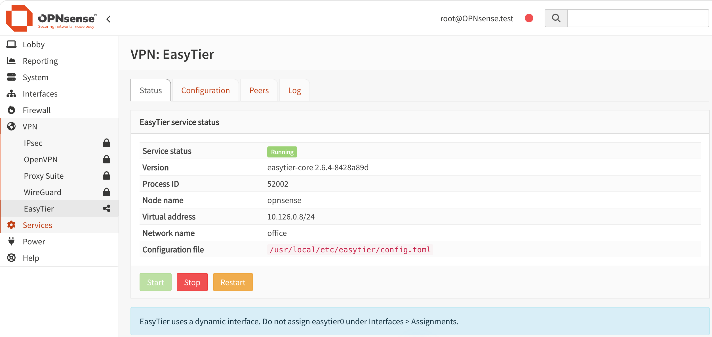
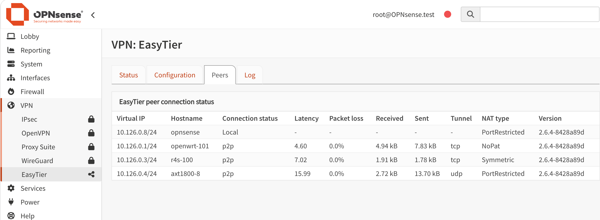

# OPNsense EasyTier 插件

`os-easytier` 是适用于 OPNsense 的 EasyTier 组网 VPN 插件。它集成 EasyTier Core，可在 **VPN > EasyTier** 中完成配置、服务管理、状态查看、节点查看和日志排查。

当前插件版本：`1.0.0`

内置 EasyTier 版本：`2.6.4`



## 支持平台

| OPNsense | FreeBSD ABI | 架构 | 状态 |
| --- | --- | --- | --- |
| OPNsense 26.7 | `FreeBSD:15:amd64` | amd64 | 已测试 |

当前构建脚本仅接受 FreeBSD 15 amd64 ABI。请勿在其他架构或 FreeBSD 主版本上强制安装。

## 主要功能

- 在 OPNsense WebGUI 中启动、停止和重启 EasyTier
- 直接编辑 EasyTier TOML 配置文件
- 显示服务状态、版本、进程、节点名称、虚拟地址和网络名称
- 显示节点延迟、丢包率、流量、隧道和 NAT 类型
- 支持英文、简体中文和繁体中文，其他语言默认显示英文
- 为动态 `easytier0` 接口加载 IPv4 `any to any` 状态规则
- 首次安装时复制示例配置，升级或强制重装不会覆盖现有配置
- 卸载时保留配置与日志，并避免全局防火墙重载中断 LAN 管理连接

## 目录结构

```text
packaging/freebsd/                                      FreeBSD pkg 元数据及安装、卸载脚本
src/etc/rc.conf.d/easytier                              rc.conf 默认设置
src/usr/local/etc/easytier/config.toml.sample           安装示例配置
src/usr/local/etc/rc.d/easytier                         EasyTier rc.d 服务
src/usr/local/etc/inc/plugins.inc.d/easytier.inc        OPNsense 服务与防火墙集成
src/usr/local/opnsense/service/conf/actions.d/           configd 服务动作
src/usr/local/opnsense/mvc/app/models/OPNsense/EasyTier/ 菜单和 ACL 模型
src/usr/local/sbin/easytier-core                         EasyTier 核心程序
src/usr/local/sbin/easytier-cli                          EasyTier 命令行工具
src/usr/local/www/easytier.php                           WebGUI 页面
images/                                                  README 页面截图
```

## 安装

### 通过 Opnwall 社区仓库安装

在 OPNsense 控制台或 SSH 中执行：

```sh
fetch -o /usr/local/etc/pkg/repos/opnwall.conf \
  https://opnwall.github.io/OPNsense-repo/opnwall.conf

pkg update -f
pkg install os-easytier
```

也可以进入 **系统 > 固件 > 插件**，查找并安装 `os-easytier`。

### 离线安装

下载与 FreeBSD 15 amd64 对应的软件包，然后执行：

```sh
pkg add -f os-easytier.pkg
```

安装完成后刷新 WebGUI，进入 **VPN > EasyTier**。

## 配置和使用

首次安装且正式配置不存在时，插件会把示例文件复制到：

```text
/usr/local/etc/easytier/config.toml
```

文件权限为 `0600`。进入 **VPN > EasyTier > 配置**，按实际网络修改配置文件。至少需要设置节点名称、虚拟地址、初始连接节点、网络名称、网络密钥和需要发布的本地网段。

```toml
instance_name = "OPNsense"
hostname = "opnsense"
ipv4 = "10.125.0.1/24"
dhcp = false

listeners = [
    "tcp://0.0.0.0:11010",
    "udp://0.0.0.0:11010",
]

rpc_portal = "127.0.0.1:15888"

[[peer]]
uri = "tcp://服务器地址:11010"

[[proxy_network]]
cidr = "192.168.10.0/24"

[network_identity]
network_name = "office"
network_secret = "请替换为自己的网络密钥"

[flags]
dev_name = "easytier0"
default_protocol = "tcp"
enable_encryption = true
enable_ipv6 = false
mtu = 1300
private_mode = true
proxy_forward_by_system = true
```

点击 **保存并重启** 后，到状态、节点和日志页面确认运行结果。

[查看完整示例配置](src/usr/local/etc/easytier/config.toml.sample)



## 动态接口与防火墙规则

EasyTier 运行时创建 `easytier0` TUN 接口。插件通过 OPNsense Firewall Plugin API 注册专用锚点，并在接口存在时加载以下等效规则：

```text
pass in quick on easytier0 inet from any to any flags S/SA keep state
```

该默认规则便于不同 EasyTier 虚拟地址和代理网段直接通信。正式环境可根据实际安全要求修改插件规则，限制来源、目标和端口。

**不要在“接口 > 分配”中手工添加 `easytier0`。** 它是动态 TUN 接口，固定分配可能干扰启动时的接口识别。插件只在运行时创建接口，停止或卸载时会清理接口和 EasyTier 专用防火墙锚点。

## 远端子网访问

如需访问 EasyTier 节点后方的局域网设备，应在远端节点发布对应网段：

```toml
[[proxy_network]]
cidr = "192.168.101.0/24"
```

如果只能访问远端路由器，不能访问其后方客户端，请依次检查：

- 远端代理网段是否正确发布
- 远端系统是否允许 IPv4 转发
- 客户端默认网关是否指向远端路由器
- 客户端主机防火墙是否允许来自 EasyTier 网段的流量
- 两端局域网网段是否发生重叠

## 配置与日志保留

以下文件在升级、强制重装和卸载时保留：

```text
/usr/local/etc/easytier/config.toml
/var/log/easytier.log
```

示例配置只在正式配置不存在时复制，不会覆盖用户已经修改的配置。

## 卸载

```sh
pkg delete os-easytier
```

卸载脚本会：

- 在限定时间内停止 EasyTier 进程
- 清理 `easytier0`、PID 文件和 EasyTier 专用防火墙规则
- 清理 VPN 菜单缓存和 configd 注册
- 保留配置文件与日志

## 编译

必须在 FreeBSD 15 amd64 或对应的 OPNsense 主机上编译，并确保系统已安装 `pkg`：

```sh
make package
```

也可以直接调用构建脚本：

```sh
ABI=native OUTPUT_NAME=os-easytier.pkg sh build.sh
```

如需生成通用 FreeBSD 15 amd64 ABI 标记的软件包：

```sh
ABI=FreeBSD:15:amd64 OUTPUT_NAME=os-easytier-freebsd15.pkg sh build.sh
```

构建结果位于 `dist/`：

```text
dist/os-easytier.pkg
```

## 注意事项

- 不要把 `easytier0` 分配为 OPNsense 固定接口。
- 不要使用 Cron 或 Shellcmd 重复添加 EasyTier 启动命令。
- 不要在多个节点中重复使用相同的虚拟 IP。
- 两端发布的局域网网段不能相互重叠。
- `rpc_portal` 建议保持为 `127.0.0.1:15888`，节点页面依赖该地址查询状态。
- 默认 `any to any` 规则以易用性为优先，生产环境应根据安全策略进行限制。
- 本项目为非官方社区插件，不受 Deciso、OPNsense 或 EasyTier 官方支持，使用者应自行评估风险。

## 相关项目

- [EasyTier](https://github.com/EasyTier/EasyTier)