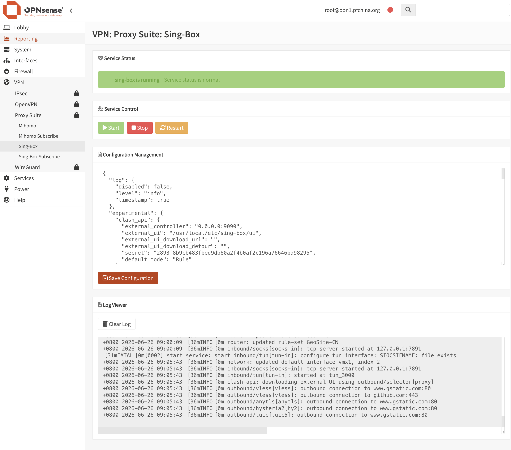

<div align="center">
  <a href="README.md">中文</a> |
  <a href="README.US.md">English</a>
</div>

# Sing-Box for OPNsense

Native OPNsense configuration backups carry the Sing-box configuration directory,
subscription environment and templates, service enable settings, and explicitly
referenced custom certificate, key, trust-directory and local rule files. Files
remain the active store; saves and subscription updates synchronize a compressed
snapshot into `config.xml`, while an independent watcher notices file edits once
per second. Imported snapshots are restored before service startup and during
package installation. Missing files and disabled service settings are preserved.
Runtime logs, locks, PID files, samples, the packaged subscription wrapper, the
core cache and editor protection key are excluded.

Custom external references must use absolute paths. Built-in system trust stores
and hosts files are supplied by OPNsense and are not duplicated. Synchronization
failures leave saved files intact and report a generic warning. Reinstall the
compatible plugin before starting services after restoring a native backup.
Keep exported backups private: they contain subscription URLs and proxy credentials.
The snapshot checks schema, checksum and permitted paths before writing, restores
bytes and permissions, removes stale owned files, and rolls back on failure.
The existing package-upgrade scratch backup also remains for older packages.


sing-box is a powerful, high-performance open source proxy platform that supports many mainstream proxy protocols. It can be used for proxying, traffic routing, load balancing, and secure access scenarios.

This project integrates sing-box into the OPNsense WebGUI with transparent proxy support, configuration editing, service management, status monitoring, and log viewing.

Tested on:

- OPNsense 26.1.9



## Binary

The project uses the static binary from [Vincent-Loeng](https://github.com/Vincent-Loeng/bsd-box). The default local asset path is:

```text
bin/bsd-box-reF1nd-freebsd-amd64.xz
```

The build script prefers the local `bin/bsd-box-reF1nd-freebsd-amd64.xz` file. If it is missing, the script downloads it from GitHub:

```text
https://github.com/Vincent-Loeng/bsd-box/releases/latest/download/bsd-box-reF1nd-freebsd-amd64.xz
```

## Routing, device policy and basic services

A first installation leaves the service stopped and defaults to explicit SOCKS
proxy use. Configure valid nodes and click Start. The service renders a private
runtime copy; the complete saved JSON, subscription URL, credentials and future
fields remain unchanged. A legacy JSON `auto_route: true` does not provide
transparent consent: enable and confirm LAN capture separately after upgrading.

Select Transparent LAN capture, confirm the intended capture, save and restart.
The saved JSON must contain one gVisor TUN with a private prefix that does not
overlap existing routes and real-address DNS. The runtime disables automatic
routing and removes modern and legacy explicit TUN route ranges. A private FIB
and non-quick PF match rules select new LAN TCP/UDP flows before TUN. Router
traffic, WAN returns and the main FIB keep their native paths; administrator
blocks, explicit gateways and specific VPN/static routes retain priority.

Device IP/CIDR policy selects only whitelist entries or bypasses blacklist
entries before TUN. An empty list selects all LAN devices. Core DIRECT outbound
rules do not implement this bypass. Applying policy by restarting clears only
owned captured states. ICMP, DHCP, multicast and neighbor discovery remain
native. IPv6 capture is separately enabled and requires a TUN IPv6 address;
otherwise IPv6 remains native, with DHCP/RA settings unchanged.

The plugin never rewrites `/etc/resolv.conf`, changes Unbound forwarding or
restarts DNS services. LAN queries to OPNsense remain with Unbound. Transparent
capture requires real addresses, without fake IP. Do not bind the system DNS
root forwarder to a port available only while this proxy runs. Multi-WAN DNAT
should retain an associated filter rule with correct `reply-to`; the plugin
preserves administrator NAT and foreign connection states.

An independent watcher removes owned capture after a Core failure or suspension, restores
native routes in the private FIB and removes only states belonging to its FIB/TUN.
Pending recovery is retried. A suspended Core retains signal ownership and can
be stopped safely. Continuing the Core leaves native routing in place until an
explicit Restart restores capture. The service page reports suspension, pending
recovery and the need to restart capture. A closed TUN is removed only when its
kernel interface index, driver and random ownership description still match;
open or changed interfaces are preserved. Stop and startup failures perform the same scoped
cleanup without global process-name killing. Uninstall retains private settings
and recovery records. Only unchanged journal-owned interfaces/rules without
other policy references may be removed.

## Install

Upload the package to OPNsense and run:

```sh
pkg add -f os-sing-box-1.1.5.pkg
```

Refresh the OPNsense WebGUI and go to:

```text
VPN > Proxy Suite > Sing-Box
```

The MVC page at `/ui/singbox` groups configuration, subscriptions and logs.
The API omits the subscription URL and redacts credentials in the configuration
editor. Keep the entire placeholder beginning with `__SING_BOX_KEEP_STORED_VALUE__`
unchanged to retain a stored value. Reload an old editor snapshot after a
subscription update before saving it.
The package ships settings as samples and retains existing JSON, subscription
environment files, templates and enable choices during upgrades.

## Uninstall

```sh
pkg delete os-sing-box
```

## Subscription Updates

The plugin fetches a complete Sing-box JSON subscription directly; YAML/template conversion is no longer supported. The private URL stays outside process arguments and logs. HTTP failures do not retry. The current maintained package targets FreeBSD 15; legacy ABI downloads remain archived.

Automatic subscription updates can be scheduled with Cron:

```text
System > Settings > Cron
```

Add a scheduled task and select:

```text
Renew sing-box Subscription
```

## Build pkg

Build on a FreeBSD host. Required commands:

```sh
pkg, tar, make, xz, python3, curl or fetch
```

Run:

```sh
make package ABI=native
```

Output file:

```text
dist/os-sing-box-1.1.5.pkg
```

Inspect package metadata:

```sh
pkg info -F dist/os-sing-box-1.1.5.pkg
```

## Common Commands

Service control:

```sh
service sing-box start
service sing-box stop
service sing-box status
service sing-box restart
service sing-box rcvar
```

Configuration validation:

```sh
sing-box check -c /usr/local/etc/sing-box/config.json
```

View logs:

```sh
tail -f /var/log/sing-box.log
```

Check listening ports:

```sh
sockstat -4 -l | egrep ':53|:7892|:9091'
```

Check the TUN interface:

```sh
ifconfig tun_singbox
```

Check runtime firewall rules:

```sh
pfctl -sr | grep -E 'tun_singbox'
```

## Credits

[SagerNet](https://github.com/SagerNet/sing-box)<br>
[Vincent-Loeng](https://github.com/Vincent-Loeng?tab=repositories)

## Disclaimer

> [!CAUTION]
> This is an unofficial plugin and is not supported by the OPNsense team. Use it at your own risk.
