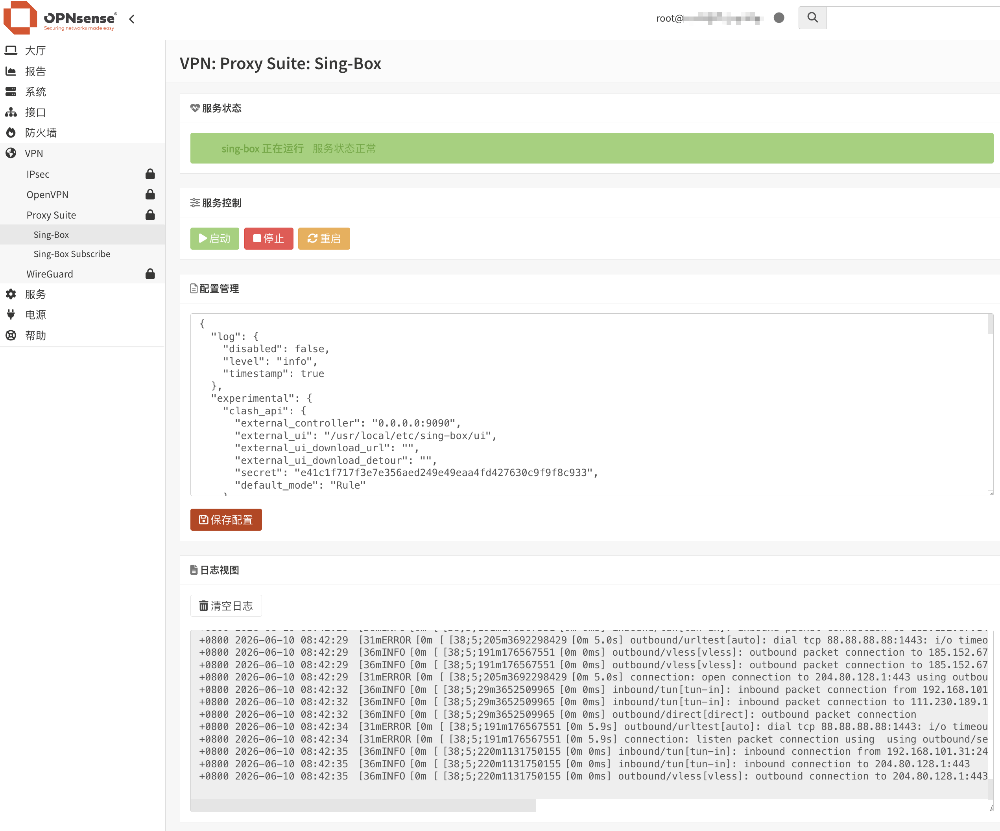

<div align="center">
  <a href="README.md">中文</a> |
  <a href="README.US.md">English</a>
</div>

# Sing-Box for OPNsense

OPNsense 常规 `config.xml` 备份包含 Sing-box 配置目录、订阅环境和模板、服务启用
设置，以及配置中明确引用的自定义证书、密钥、信任目录和本地规则文件。保存配置和
订阅更新会同步压缩快照；独立监视进程每秒检查文件编辑。安装插件或启动服务前会
恢复导入的快照，并保留缺失文件和禁用状态。运行日志、锁、PID、样例、软件包
提供的订阅脚本、内核缓存及编辑器保护密钥不进入备份。

外部文件引用必须使用绝对路径；系统信任库和默认 hosts 文件由 OPNsense 提供。
同步失败会保留已保存的文件并显示通用警告，不返回凭据。恢复后需先安装兼容的
插件，再启动服务。导出的备份包含订阅 URL 和代理凭据，应作为私密文件保管。
恢复会先检查版本、校验和及允许的路径，再替换文件、恢复权限和清理过期文件；
失败时回滚。已有的软件包升级临时备份继续保留，用于兼容旧版软件包。


sing-box 是一款功能强大、性能优秀的开源网络代理平台，支持多种主流代理协议。它基于现代化架构设计，具备高性能、低资源占用和灵活配置等特点，可用于网络代理、流量分流、负载均衡以及安全访问等场景。

本项目将 sing-box 无缝集成到 OPNsense WebUI，支持透明代理，并提供配置编辑、服务管理、状态监控和日志查看等功能，使用户能够通过图形界面轻松管理 sing-box。

已在以下环境测试通过：

- OPNsense 26.7



## 项目程序

项目使用 [Vincent-Loeng](https://github.com/Vincent-Loeng/bsd-box) 静态二进制文件，默认文件路径如下：
```text
bin/bsd-box-reF1nd-freebsd-amd64.xz
```
构建脚本会优先使用本地 `bin/bsd-box-reF1nd-freebsd-amd64.xz` 文件。如果本地文件不存在，会从 Github 下载：
```text
https://github.com/Vincent-Loeng/bsd-box/releases/latest/download/bsd-box-reF1nd-freebsd-amd64.xz
```
## 路由、设备名单与基础服务

首次安装不会启动服务，默认仅提供显式 SOCKS 代理。先配置有效节点，再点击
“Start”。启动使用私有运行配置；保存的完整 JSON、订阅 URL、代理凭据和未来字段
保持原样。旧版 JSON 中的 `auto_route: true` 不代表透明代理授权，升级后需重新明确
选择透明接管。

在服务页面启用“Transparent LAN capture”，确认接管意图并保存、重启。配置必须
保留一个 gVisor TUN 入站，使用不与现有路由重叠的私有地址段和真实 IP DNS。
运行副本强制关闭内核自动路由，并移除新旧显式 TUN 路由范围；插件通过独立 FIB 和
非 quick PF match 规则选择新的 LAN TCP／UDP 流量。主 FIB、路由器自身流量和
WAN 回程保持原生路径；用户的阻断规则、显式网关和 VPN／静态路由优先。

设备名单使用 IP／CIDR：“Proxy only listed devices”只接管白名单设备，
“Bypass listed devices”使黑名单设备在进入 TUN 之前绕过。空名单接管所有 LAN
设备。名单不依赖内核中的 DIRECT 出站规则；重启应用策略时只清理插件所属的
已接管状态。ICMP、DHCP、组播和邻居发现保持原生路径。IPv6 接管需单独开启且
TUN 有 IPv6 地址，否则 IPv6 不接管，也不更改 DHCP／RA 设置。

插件不会重写 `/etc/resolv.conf`、更改 Unbound 转发或重启 DNS 服务。LAN 使用
OPNsense DNS 时继续由 Unbound 解析，透明接管要求真实 IP，不能使用 fake IP。
不要将系统 DNS 的根转发绑定到只有本代理运行时才可用的本地端口。多 WAN DNAT
仍应使用关联过滤规则与正确的 `reply-to` 回程绑定；插件不修改管理员 NAT 或连接状态。

独立监视进程在 Core 异常退出或暂停后撤销插件的接管规则、恢复私有 FIB 原生路由，并
仅清理匹配所属 FIB／TUN 的状态；恢复失败会持续重试。暂停的 Core 仍保留进程归属，
可以安全 Stop。恢复进程后继续使用原生网络，需显式 Restart 才恢复透明接管。
服务页面显示暂停、恢复待处理及需重启接管的状态。关闭的 TUN 仅在内核接口编号、
驱动名和随机归属标记仍匹配时删除；已打开或被管理员修改的设备保持不变。正常 Stop 和启动失败同样
执行所属资源清理，不会按进程名称全局杀进程。卸载保留私有设置和恢复记录；只有
仍与插件记录完全一致且未被其他规则引用的接口／规则才可删除。

## 安装命令
将安装包上传到 OPNsense 后执行：
```sh
pkg add -f os-sing-box-1.1.5.pkg
```
刷新 OPNsense WebGUI，进入：
```text
VPN > Proxy Suite > Sing-Box
```
界面地址为 `/ui/singbox`，配置、订阅和日志集中在同一页面。API 不返回订阅 URL 或配置中的凭据；保留以 `__SING_BOX_KEEP_STORED_VALUE__` 开头的完整占位符即可保留已有敏感值。订阅更新后，旧配置编辑快照必须重新加载才能保存。
安装包仅提供设置样本，升级保留现有 JSON 配置、订阅环境文件、模板和启用状态。
## 卸载命令
```sh
pkg delete os-sing-box
```
## 订阅更新

当前插件直接拉取完整 Sing-box JSON 订阅，不再支持 YAML 或模板转换。私密 URL 不进入进程参数或日志，HTTP 失败不重试。当前维护包面向 FreeBSD 15，旧 ABI 包作为兼容下载保留。
自动更新订阅可通过 Cron 完成：
```text
转到 系统>设置>任务
```
添加定时任务，在命令项，找到以下命令并添加：
```sh
Renew sing-box Subscription
```
## 编译 pkg
在 FreeBSD 主机上构建。需要以下命令：
```sh
pkg、tar、make、xz、python3、curl 或 fetch
```
运行：

```sh
make package
```
生成文件：

```text
dist/os-sing-box-1.1.5.pkg
```
检查包元数据：
```sh
pkg info -F dist/os-sing-box-1.1.5.pkg
```
## 常用命令
服务控制：
```sh
service sing-box start
service sing-box stop
service sing-box status
service sing-box restart
service sing-box rcvar
```
配置校验：

```sh
sing-box check -c /usr/local/etc/sing-box/config.json
```
查看日志：

```sh
tail -f /var/log/sing-box.log
```
检查监听端口：

```sh
sockstat -4 -l | egrep ':53|:7892|:9091'
```
检查 TUN 接口：

```sh
ifconfig tun_singbox
```
检查防火墙运行时规则：

```sh
pfctl -sr | grep -E 'tun_singbox'
```
## 致谢
[SagerNet](https://github.com/SagerNet/sing-box)<br>
[Vincent-Loeng](https://github.com/Vincent-Loeng?tab=repositories)

## 免责声明
> [!CAUTION]
> 非官方插件，无 OPNsense 团队支持。使用者自行承担一切后果。
